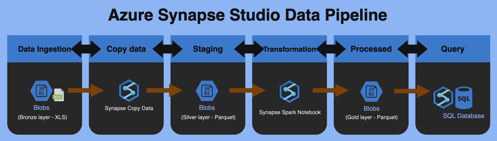
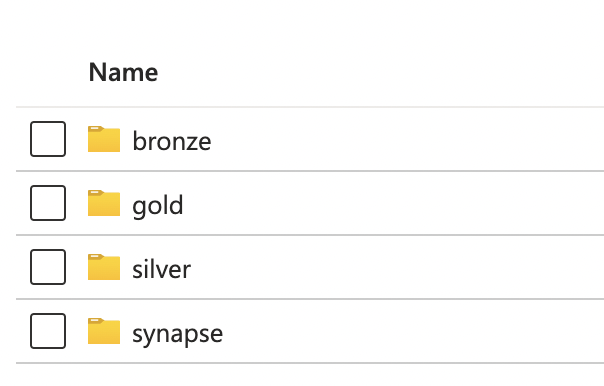
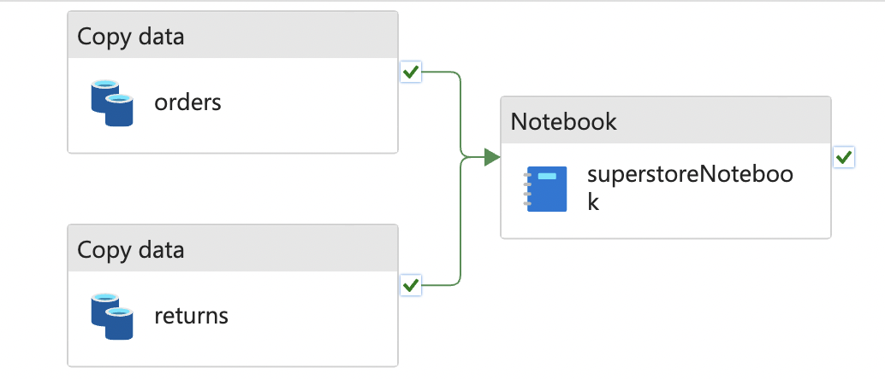
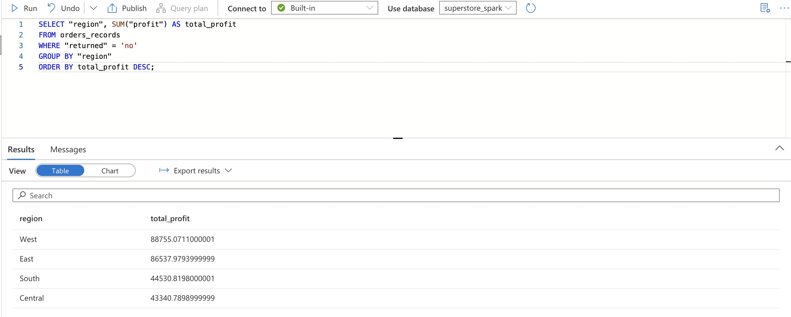

# Building an Azure Synapse Studio Data Pipeline for Profit Calcuation Analysis

In this project, I'll walk through the process of creating a Azure Synapse Studio data pipeline focused on calculating total profits from the classic Superstore dataset, sourced from Tableau. Our goal is to obtain region-wise profit insights, specifically after filtering out the returned orders.

##  Superstore Dataset Overview:
The Superstore dataset comprises two essential sheets:

Orders Sheet:
- Records order transactions.
- Key columns include order_id, region, and profit.

Returns Sheet:
- Documents returned orders, listing them by order_id.

Source: https://community.tableau.com/s/question/0D54T00000CWeX8SAL/sample-superstore-sales-excelxls

## 1. Diagram


## 2. Project Steps

<br>2.1 Blob Storage Layers

To adhere to a structured approach, adopting the Medallion Architecture best practices for data management, I establish three folders in this project:

- Bronze (Raw): Stores raw data manually uploaded by the user.

- Silver: Utilizes the Synapse Copy Data function to transform XLS files into Parquets.

- Gold: After a series of data transformations, a final Parquet file is created.



<br>2.2 Synapse Copy Data

Set the bronze folder path as the "Source" and the silver folder as the "Sink" with a Parquet format.



<br>2.3 Data Transformation

Leverage the power of the Synapse Spark Notebook for joining and cleansing datasets. A simplified logic:

2.3.1 Read Parquet from Silver Layer
```javascript
silver_folder_path = "file_system_name@account_name.dfs.core.windows.net/silver"
orders_df = spark.read.parquet(f"{silver_folder_path}/orders") 
returns_df = spark.read.parquet(f"{silver_folder_path}/returns")
```

2.3.2 Join both files and replace null with "no" in the returned column.
```javascript
join_df = orders_df.join(returns_df, "order_id", "left")
join_df = join_df.na.fill('no', subset=['returned'])
```

2.3.3 Check schema and casting before outputting the results.
```javascript
join_df = join_df.withColumn('profit', col('profit').cast('double'))
join_df = join_df.withColumn('sales', col('sales').cast('double'))
join_df.printSchema()
```

2.3.4 Output Results to Gold Layer and Create a Database in Lake Database
```javascript
%%sql
CREATE DATABASE IF NOT EXISTS db_name
LOCATION "abfss://file_system_name@account_name.dfs.core.windows.net/gold"

join_df.write.mode("overwrite").format("parquet").saveAsTable("db_name.table_name")
```


<br>2.4 Query result in Lake Database

Write a SQL query to select order_id where the return status is 'no' and calculate the sum of profit by region. This step enables us to derive valuable insights from the Superstore dataset, focusing on profitable transactions.




### Conclusion
By following these steps, you'll build a comprehensive Azure Synapse Studio data pipeline, enabling efficient analysis and visualization of Superstore data, with a specific focus on regional profits.

